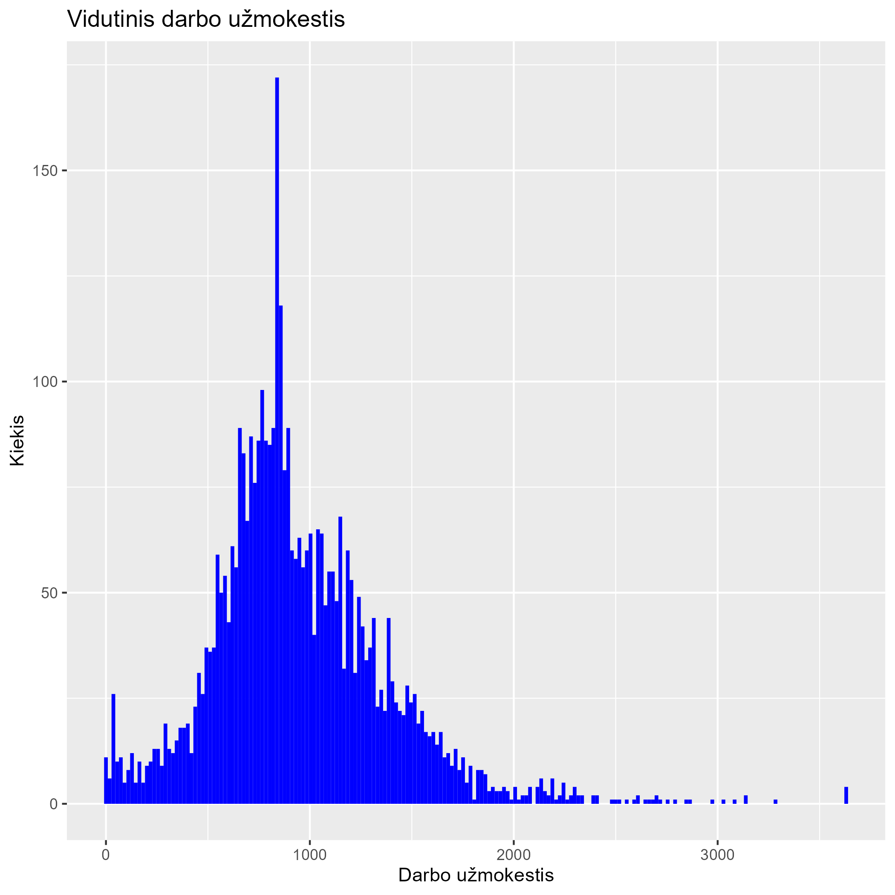
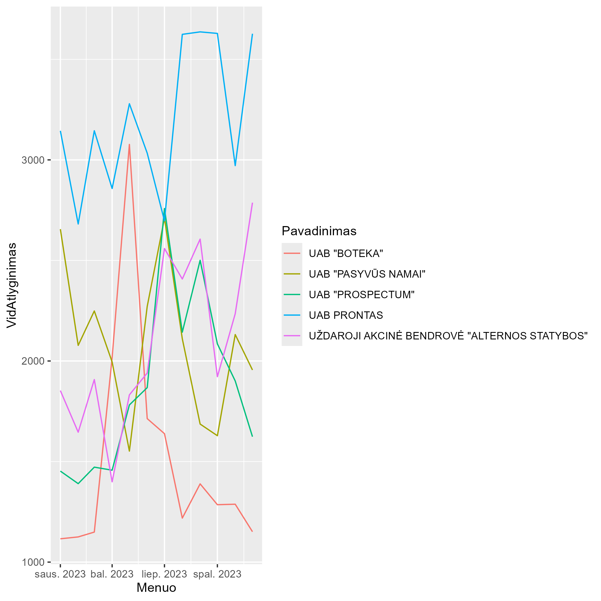
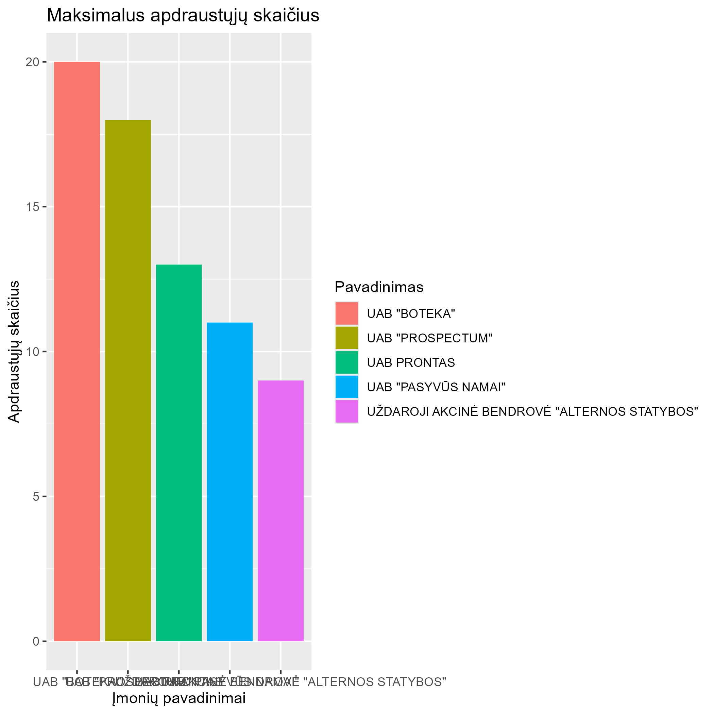
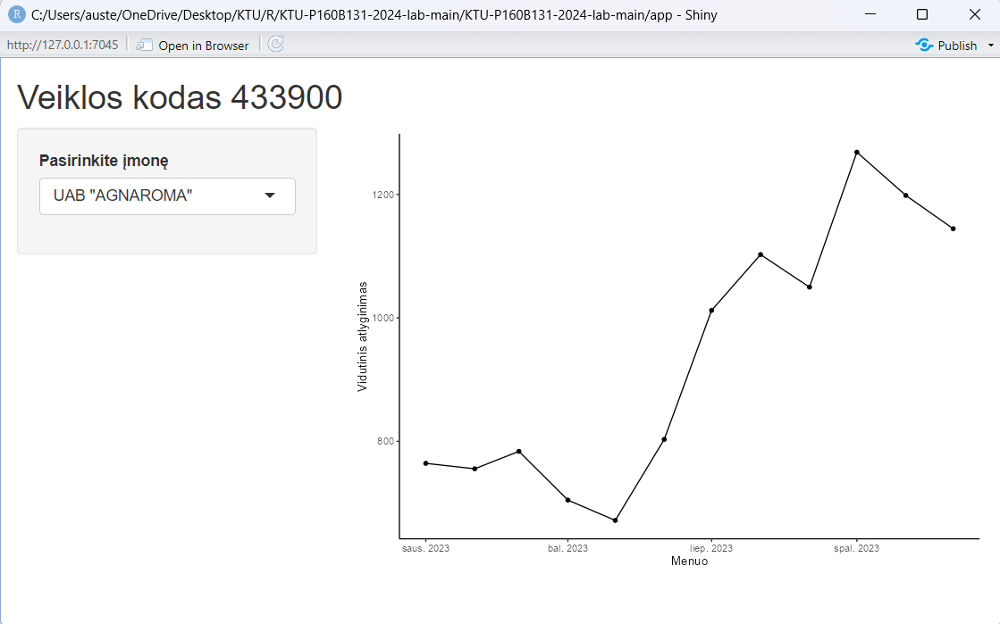

# R Laboratorinis darbas: duomenų vizualizacija

|Variantas | ecoActCode|Formatas          |
|:---------|----------:|:-----------------|
|23          |     433900|monthly-2023.csv|

### 2.1 Užduotis

Atsakymas:

Išvados: Daugiausiai žmonių gauna atlyginimą iki 1000eur.

### 2.2 Užduotis

Atsakymas:

Išvados: Didžiausi atlyginimai 2023 metais buvo įmonėje UAB PRONTAS

### 2.3 Užduotis

Atsakymas:

Išvados: Daugiausiai apdrautųjų yra įmonėje UAB "BOTEKA",o mažiausiai Uždaroje akcinėje bendrovėje "Alternos statybos"

### 3. Užduotis

Shiny R aplikacijos nuotrauka:

